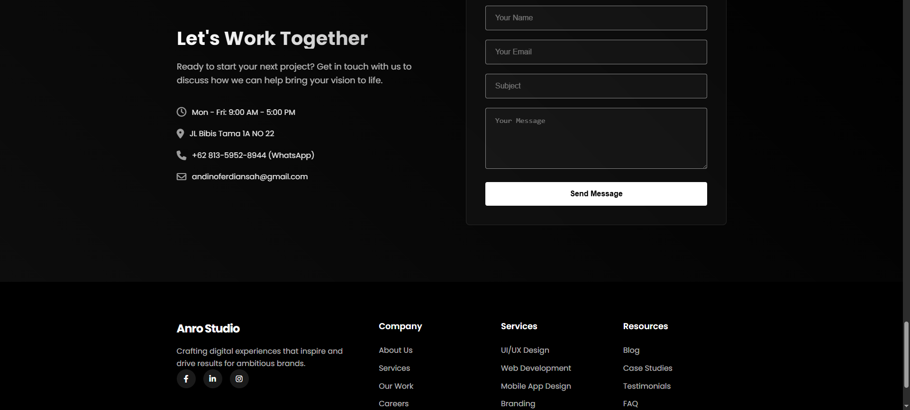

# Anro Studio - Creative Design Agency Website

A modern, responsive website for Anro Studio, a creative design agency specializing in UI/UX design, web development, and mobile app design.

## Overview

This project is a single-page portfolio website for a design agency that showcases services, work portfolio, client testimonials, and company information. The site features smooth animations, parallax effects, and an elegant design to reflect the agency's creative capabilities.

## Features

- Responsive design for all device sizes
- Modern UI with smooth animations and transitions
- Interactive portfolio gallery
- Testimonial carousel
- Contact form with validation
- Lazy loading for optimized performance
- Smooth scrolling navigation
- Parallax effects
- Preloader animation

## Screenshots

### 1.


### 2.


### 3.


### 4.


### 5.


### 6.


### 7.



## Technology Stack

- HTML5
- CSS3
- Vanilla JavaScript (ES6+)
- Font Awesome (icons)
- SweetAlert2 (notifications)
- Google Fonts (Poppins)

## Project Structure

```
/
├── index.html            # Main HTML file
├── assets/               # Static assets
│   └── favico.png        # Favicon
├── css/                  # Stylesheets
│   ├── base.css          # Base styles
│   ├── components.css    # Component styles
│   ├── layout.css        # Layout styles
│   ├── pages.css         # Page-specific styles
│   ├── preloader.css     # Preloader animation
│   ├── section.css       # Section styles
│   ├── style.css         # Main styles
│   └── utilities.css     # Utility classes
└── js/                   # JavaScript files
    ├── counters.js       # Statistics counter animations
    ├── header.js         # Header behavior
    ├── hero.js           # Hero section animations
    ├── main.js           # Main initialization script
    ├── parallax.js       # Parallax effects
    ├── preloader.js      # Preloader functionality
    ├── scroll-animations.js # Scroll-triggered animations
    ├── smooth-scroll.js  # Smooth scrolling functionality
    ├── testimonials.js   # Testimonial carousel
    ├── utils.js          # Utility functions
    └── work.js           # Portfolio gallery
```

## Installation

1. Clone this repository or download the ZIP file
2. No build process or dependencies to install
3. Open `index.html` in a web browser to view the site

## Development

To make changes to the website:

1. Edit HTML in `index.html`
2. Modify styles in the appropriate CSS files within the `css/` directory
3. Update JavaScript functionality in the relevant files within the `js/` directory

## Browser Support

The website is optimized for modern browsers including:

- Chrome (latest)
- Firefox (latest)
- Safari (latest)
- Edge (latest)

## License

This project is intended for demonstration and portfolio purposes.

## Credits

- Images: Unsplash
- Icons: Font Awesome
- Notifications: SweetAlert2
- Fonts: Google Fonts (Poppins)
